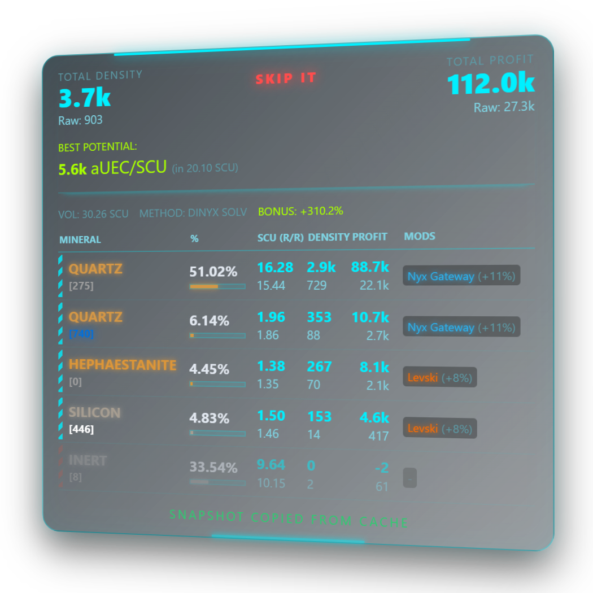
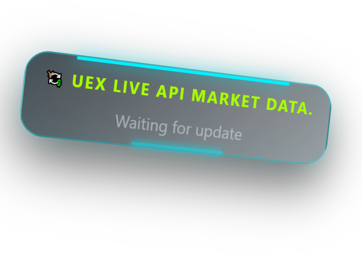
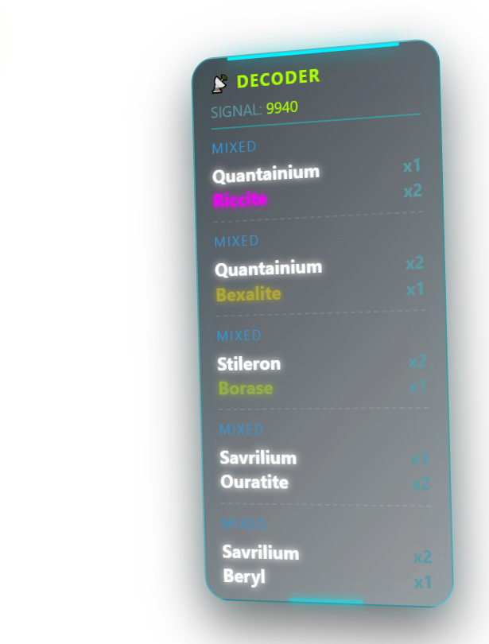

# 📡 LithoScan HUD (v1.0.0)

Advanced Holographic Mining & Signature Overlay for Star Citizen (Alpha 4.7+).

  <a href="https://Lomikk.github.io/SC-LithoScan-HUD/"><strong>🔮 Visit Live Web Demo & Website</strong></a> |
  <a href="https://github.com/Lomikk/SC-LithoScan-HUD/releases/latest"><strong>💾 Download Installer</strong></a>

---

## Core Features

### 📊 Advanced Yield Analytics

  

Get a complete breakdown of every cluster instantly. The app analyzes density, mass, and composition to project your exact SCU output and potential aUEC profit. Instantly compare raw selling prices against active refinery methods to make the most lucrative decisions on the fly.

---

### 💱 Live UEXCorp Market Data

  

The Stanton economy is constantly shifting. LithoScan HUD pulls live commodity prices and refinery yield bonuses directly from the UEXCorp API. It automatically highlights the best refinery stations to maximize your profit margin.

---

### 📡 Long-Range Signature Decoder

  

Never waste hydrogen fuel flying to a worthless rock again. Our built-in signal decoder lets you identify asteroid contents from kilometers away. Just input the ping signature (e.g., 9940), and the HUD will reveal hidden Quantainium or Bexalite deposits before you even approach [3].

---

## How to Install
1. Download the latest installer from the **[Releases](https://github.com/Lomikk/SC-LithoScan-HUD/releases/latest)** section.
2. Run the installer (No Python or Node.js required, everything is packaged!).
3. Run the desktop shortcut.
4. Launch Star Citizen, hover over a rock, and start mining smart!

## Default Hotkeys
* `Alt + G` - Toggle Edit/Game mode (unlocks window dragging and positioning).
* `Alt + V` - Hide/Show the entire HUD overlay.
* `Alt + 1` / `Alt + 2` - Set Asteroid Scan Area.
* `Alt + X` - Scan Asteroid composition.
* `Alt + 3` / `Alt + 4` - Set Signature Scan Area.
* `F3` - Decode Signature.

*Note: You can easily customize these hotkeys in `backend/data/hotkeys.json` after installation.*

## Tech Stack
* **Frontend:** Electron.js, HTML5, CSS3 (3D holographic matrix, blur filters).
* **Backend:** Python (asyncio, websockets).
* **Core Engines:** RapidOCR (Neural network text detection & recognition), PyInstaller (standalone bundling).

## Credits & Third-Party Assets
* **Signature Database (`signatures.json`):** Derived from the database originally compiled by [Mallachi](https://github.com/Diftic) (Copyright (c) 2026 Mallachi), used under the terms of the [MIT License](https://github.com/Diftic/SC_Signature_Scanner/blob/master/LICENSE).

## Disclaimer
This is a fan-made community tool. LithoScan HUD is not affiliated with, authorized by, endorsed by, or in any way officially connected with the Cloud Imperium group of companies. Star Citizen®, Roberts Space Industries®, and Cloud Imperium® are registered trademarks of Cloud Imperium Rights LLC.
