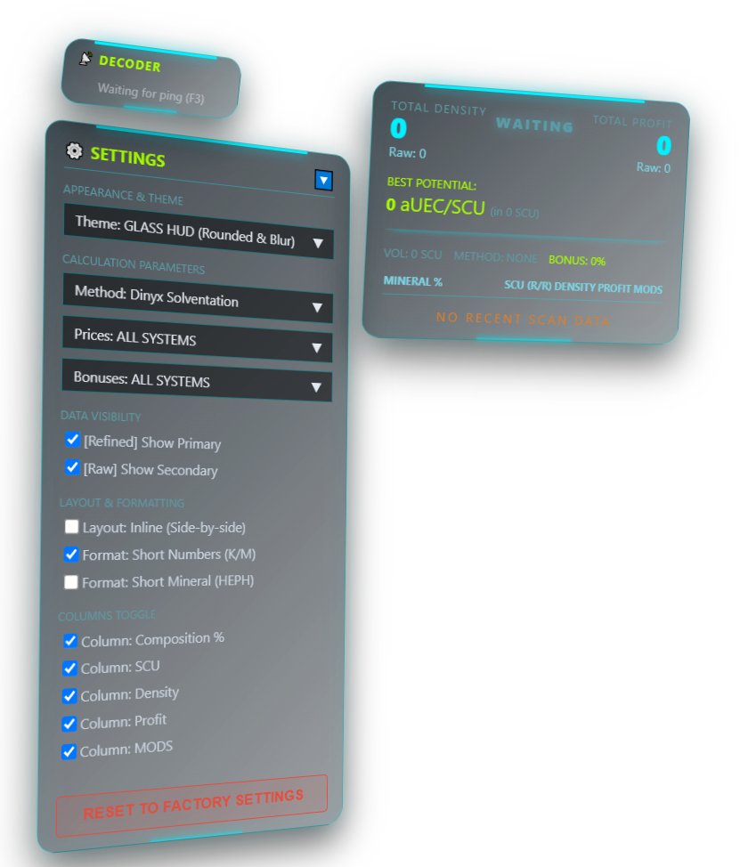

  <h1>LithoScan HUD</h1>
  <h3>Advanced Yield Analyzer for Star Citizen</h3>
  
<strong>Stop Guessing. Start Mining Smart.</strong>

  
  

    
    
    
  

  

    ✨ <b>Want a quick preview?</b> Check out our <b>Interactive Web Demo</b>! 
    Click the screenshot to trigger a simulated scan, see the UI animations in action, and try switching between different HUD themes directly in your browser.
  

 

A transparent overlay for Star Citizen miners. Estimate your yield, decode radar signatures, and get back to mining. The tool uses real-time screen capture via global hotkeys, runs locally on your machine, and requires no complicated setup.

---

## 🚀 Core Features

  
  <h3>Yield Analytics</h3>
  Get a clear breakdown of asteroid clusters instantly. The overlay calculates the price-to-volume ratio (Density) and estimates the "Best Potential" yield for optimal fracturing. With built-in smart verdicts and highlighted mineral grades, you can quickly decide which rocks are truly worth your time.

 
 

  
  <h3>Live UEXCorp Market Data</h3>
  LithoScan HUD pulls current commodity prices and refinery yield bonuses directly from the <a href="https://uexcorp.space/" target="_blank">UEXCorp API</a>. It automatically calculates the best refinery stations for your specific cargo to help optimize your routes and ensure your profit calculations are always up-to-date with the current game economy.

 
 

  
  <h3>Signature Decoder</h3>
  Evaluate radar pings before closing in. By scanning the signature number directly from your screen, the overlay calculates all possible mineral combinations, revealing potential high-value deposits from a distance.

 
 

  
  <h3>HUD Customization</h3>
  Adjust the overlay to fit your preferences. The settings panel allows you to toggle specific data columns, switch between full and abbreviated number formats, and change visual themes (such as Glass, Classic, or Amber) to match your ship's UI.

 
 

---

## ⌨️ Default Hotkeys
* `Alt + G` - Toggle Edit/Game mode (unlocks window dragging and positioning).
* `Alt + V` - Hide/Show the entire HUD overlay.
* `Alt + 1` / `Alt + 2` - Set Asteroid Scan Area.
* `Alt + X` - Scan Asteroid composition.
* `Alt + 3` / `Alt + 4` - Set Signature Scan Area.
* `F3` - Decode Signature.

*Note: You can easily customize these hotkeys in `backend/data/hotkeys.json` after installation.*

---

## ⚙️ Architecture & Under the Hood

LithoScan HUD operates using two main components communicating locally:

### 1. The Frontend (UI & Overlay)
* **Framework:** [Electron.js](https://www.electronjs.org/) (Chromium-based).
* **Tech:** HTML5, CSS3, Vanilla JavaScript.
* **Role:** The transparent overlay renders, allowing you to play the game while the HUD is active. 
* *Note:* Like any Chromium application, Electron splits its tasks into several micro-processes (Main, Renderer, GPU). This is why you will see multiple "LithoScan HUD" processes in your Task Manager, and why it occupies a certain baseline amount of RAM.

### 2. The Backend (OCR & Mathematics)
* **Language:** [Python 3](https://www.python.org/).
* **Core Libraries:**
  * **RapidOCR (ONNX Runtime):** Local neural network for text recognition.
  * **MSS (Multiple Screen Shots):** Screen capture.
  * **OpenCV (`cv2`) & NumPy:** For in-memory image processing.
  * **WebSockets (`asyncio`):** For communication with the Frontend.
* **Role:** Runs in the background (`lithoscan_backend.exe`). It listens for global hotkeys, captures a small region of the screen directly into RAM, reads the text, calculates the most profitable refining yield, and pushes the JSON result to the UI.

---

## ⚡ Performance & Resource Usage

Due to the nature of Electron and local OCR processing, the app is not perfectly lightweight. Here is an honest breakdown of what you can expect:

| Component | CPU Usage | RAM Usage | Disk I/O | Notes |
| :--- | :--- | :--- | :--- | :--- |
| **Idling in Background** | **0%** | **~200 MB** | **0 MB/s** | Baseline usage while waiting for hotkeys. |
| └ Backend (Python OCR) | 0% | ~115 MB | 0 MB/s | Loaded into memory, standing by. |
| └ Frontend (Electron UI) | 0% | ~85 MB | 0 MB/s | UI rendering processes. |
| **During Active Scan** | **Spikes** | **~200 MB+** | **0 MB/s** | *The neural network will briefly load your CPU/GPU to process the image and extract text.* |

---

## 🛡️ Anti-Cheat (EAC) & TOS Safety

**LithoScan HUD is designed to comply with Star Citizen's Terms of Service and Easy Anti-Cheat (EAC) guidelines.**

Here is how it interacts with your system:
* **Read-Only Screen Capture:** It uses standard OS-level screen capture (like OBS Studio or Discord screen share). It does **not** read game memory, alter game files, or inject DLLs into the game client.
* **No Input Injection:** The application does **not** automate gameplay or send fake inputs (no macros, no aimbots). 
* **Native Click-Through:** When interacting with the game, the overlay uses the native Windows `WS_EX_TRANSPARENT` flag. It does not "intercept and forward" your mouse clicks; it simply tells Windows to make the overlay physically intangible, so your hardware mouse clicks go directly to the game.
* **Passive Hotkeys:** It listens for your specific hotkeys (like `Alt+X`) purely passively, exactly like Discord's Push-to-Talk feature.

*Disclaimer: LithoScan HUD is a third-party fan-made tool. While its architecture strictly avoids malicious behaviors targeted by Anti-Cheats, Cloud Imperium Games retains the right to moderate third-party software. Use it at your own discretion.*

---

## 🎥 See It In Action

Watch how the overlay seamlessly integrates with the Star Citizen HUD.

<video src="docs/images/demo-video.mp4" controls="controls" style="max-width: 100%;"></video>

---

## 📥 Download & Installation

1. Go to the [Releases Page](https://github.com/Lomikk/SC-LithoScan-HUD/releases/latest).
2. Download the latest `.exe` or `.zip` archive for Windows (64-bit).
3. Run the application and launch Star Citizen.

**Requirements:** Windows 10 / 11.

---

## 📜 Credits & Third-Party Assets
* **Signature Database (`signatures.json`):** Derived from the database originally compiled by [Mallachi](https://github.com/Diftic) (Copyright (c) 2026 Mallachi), used under the terms of the [MIT License](https://github.com/Diftic/SC_Signature_Scanner/blob/master/LICENSE).
* **Optical Character Recognition:** Powered by [RapidOCR](https://github.com/RapidAI/RapidOCR) (Copyright (c) 2021 RapidOCR Authors / RapidAI), used under the terms of the [Apache License 2.0](https://www.apache.org/licenses/LICENSE-2.0).

* ### Additional Libraries
The Python backend is built using the following open-source libraries, licensed under MIT, BSD, and Apache 2.0:
* `rapidocr-onnxruntime` (Apache 2.0) - ONNX runtime for RapidOCR.
* `opencv-python` (Apache 2.0 / MIT) - In-memory image processing.
* `numpy` (BSD) - High-performance array calculations.
* `mss` (MIT) - Ultra-fast desktop screen capture.
* `websockets` (BSD) - Real-time communication server.
* `keyboard` & `mouse` (MIT) - Global input hooking.
* `pywin32` (PSF) - Windows API interactions.
* `requests` (Apache 2.0) - Market data API fetching.

## ⚖️ Disclaimer

*© 2026 LithoScan HUD. An open-source tool for the Star Citizen community.*

This project is a fan-made tool and is not affiliated with Cloud Imperium Rights LLC or Star Citizen.
